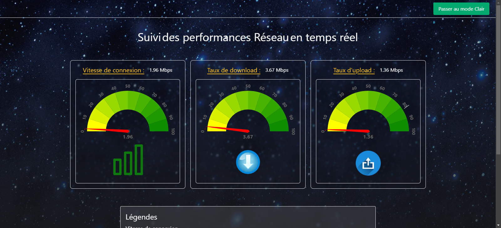

# Captive zone



Bienvenue dans Captive zone. Ce projet est un exemple de mise en oeuvre d'une application fullstack en JavaScript, avec une structure simple pour le client et le serveur.

## Table des matières
- [Description](#description)
- [Fonctionnalités](#fonctionnalités)
- [Installation](#installation)
- [Licence](#Licence)

## Description
Ce projet est conçue pour démontrer l'utilisation des websockets sans avoir recours à des méthodes HTTP. Cela affiche en temps réel la vitesse de connexion de l'utilisateur, ainsi que le taux de download et le taux d'upload. La plateforme est conçue pour offrir une interface utilisateur moderne et réactive, adaptée aux différents appareils tels que les ordinateurs, les tablettes et les smartphones.

#### Technologies Utilisées
Backend : Node.js avec Express.js, utilisé pour la gestion des requêtes serveur et la communication en temps réel via WebSocket.
Frontend : Next.js, pour la création d'une interface utilisateur dynamique et responsive avec un rendu côté serveur (Server-Side Rendering).
API de Vitesse : Utilisation de l'API de Fast.com pour récupérer les données de vitesse de connexion.

## Fonctionnalités
- Client avec NextJs et qui offre plus de contrôle sur la stylisation
- Interface utilisateur simple
- Serveur avec ExpressJs
- Contrôle et filtrage des sources de requête.

## Installation
1. Lancer le serveur :
 Depuis le dossier racine. Naviguer dans le dossier backend et ouvrer le terminal, puis exécuter les commandes pour l'installation des dépendances :
    ```bash
        npm i
        npm run dev
2. Créer le fichier env dans le dossier backend et ajouter le token de l'api :
    ```bash
        touch .env

3. ### Pour récupérer le token de fast.com

Rendez-vous sur fast.com, ouvrez les outils de développement de votre navigateur, allez dans l'onglet Réseau et copiez le token dans l'URL de la requête qui ressemble à : https://api.fast.com/netflix/speedtest?https=true&token=le-token&urlCount=5.    

4. Ajouter votre token en éditant le fichier .env :         
FAST_SPEED_TOKEN=votre-token-a-remplacer-par-le-vrai

5. Lancer le client :
Depuis le dossier racine. Naviguer dans le dossier captivezone et ouvrer le terminal, puis exécuter les commandes pour l'installation des dépendances :    
    ```bash
        npm i
        npm run dev

## LICENCE
1. **Ce projet est sous la licence MIT**

